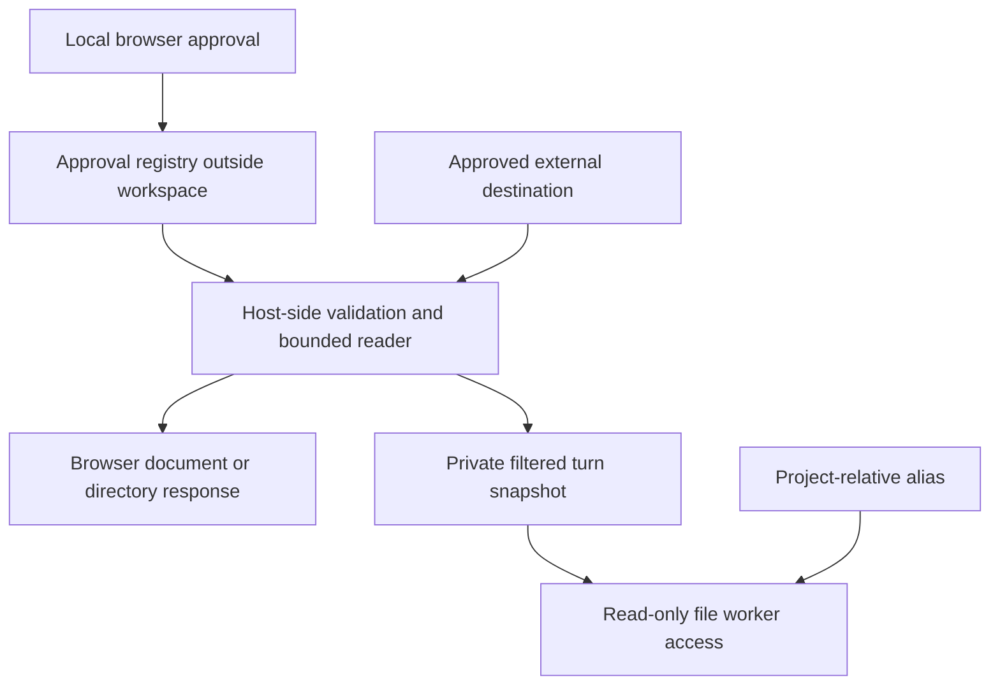

# Follow approved external symlinks

Implement selective, read-only access to files and directories outside the
workspace through user-approved symlinks inside an existing project. Users can
browse linked content and let the selected project's agent read it without
granting general access to the destination's parent directory.

Status: implementation specification. This document describes new behavior;
the feature is not implemented yet. Treat **must** requirements as acceptance
criteria. You can change private helper names, but preserve the contracts below.

## Before you begin

- Read `src/server.js`, `src/tool-worker.js`, `src/pi-harness.mjs`,
  `src/macos-sandbox.sb`, `src/agent-instructions.js`, and `src/tool-approvals.js`.
- Read the matching server, worker, harness, HTTP security, and tool security
  tests under `test/`.
- Use Node.js as specified in `package.json`. Linux integration tests require
  Bubblewrap; macOS integration tests require the existing Seatbelt backend.
- Edit source files, not generated files in `dist/`.
- Preserve ordinary project access, existing cross-project file grants, denied
  filenames, document limits, and the default rejection of unapproved escapes.
- Read [the threat model](THREAT-MODEL.md) and
  [the project context specification](PROJECT-SCOPED-CONTEXT-SPEC.md).
  This specification supersedes blanket external-link rejection only for the
  explicitly approved read operations described here.

## Define the product behavior

Given this layout:

```text
/home/ed/workspace/project-a/reference -> /home/ed/reference-material
/home/ed/reference-material/guide.md
```

After approval, the browser opens
`/workspace/project-a/reference/guide.md`, and project A's agent calls
`read_file({path: "reference/guide.md"})`. Both expose the contents of the external
file. Responses retain the workspace alias. They must not turn host paths into
browser URLs or model-facing tool arguments.

Implement the following scope:

| Capability | Version 1 behavior |
| :--- | :--- |
| External regular-file link | Approve and read the one file. |
| External directory link | Approve and read eligible descendants. |
| Browser | Show linked entries, navigate directories, and render supported documents. |
| Agent | Support `list_files`, `search_files`, `read_file`, and `extract_document`. |
| Writes | Reject edits, creates, moves, renames, deletes, patches, and artifact promotion through the link. |
| Execution | Do not grant external inputs to workspace executables or Python. |
| Project discovery | Do not treat a top-level external symlink as a project. |
| Other projects | Do not inherit project A's grant. |
| Workspace-mode chat | Do not inherit project grants in version 1. |
| Cross-project mentions | Do not create external grants from `@project/path` references. |
| Instructions | Do not load external `AGENTS.md` as instructions. Agents can read it as ordinary content. |

Approval permits both browser reads and reads by the selected project's model
provider. State this in the confirmation UI. Do not create agent tools that can
approve links, alter approval records, or accept arbitrary host destinations.

### Choose snapshots for the first implementation

Use private, bounded copies of approved content. Do not mount live external
directories into workers in version 1. The existing `stageReadGrants()` is the
starting pattern, but it does not yet provide directory grants or alias routing.

Create a fresh snapshot for each chat turn. Browser operations read a freshly
validated file or bounded directory listing through the same host-side reader.
A chat turn sees the file versions copied at its start; a later turn sees later
edits. Directory snapshots are not atomic across multiple source files. Include
`capturedAt` in turn capability metadata and explain this behavior in the UI.

This decision limits sandbox changes and preserves identical content filtering
on Linux and macOS. Defer live directory mounts and write permissions.
Do not silently implement either as a shortcut.

## Trace the access boundary



Keep persistent state outside the workspace, immutable capabilities within each
turn, and file copying separate from approval management. The design requires no
new hosted services or paid dependencies. Each active turn uses at most the snapshot
storage limit below, plus existing worker overhead.

| Component | Required change |
| :--- | :--- |
| New `src/external-links.js` | CommonJS module for registry, inspection, validation, filtered reads, and snapshots. |
| New `src/path-policy.js` | Share pure containment and denied-name helpers between host and worker. Preserve existing internal-path behavior. |
| `src/server.js` | Add approval endpoints, browser resolution, navigation entries, mutation rejection, and revocation coordination. |
| `src/pi-harness.mjs` | Build project-bound external capabilities, stage content, map aliases, and clean up snapshots. |
| `src/tool-worker.js` | Resolve approved aliases for reads and traversal; reject them for writes and execution. |
| `src/public/app.js`, `app.css`, `index.html` | Add link inspection, approval, status, and revocation UI using existing UI conventions. |
| `src/macos-sandbox.sb` | Reuse read-only grant storage permissions; do not allow original external paths. |

The worker currently runs as source through `node --eval`, without access to the
package directory. If you extract shared helpers, inject their source into the
worker bootstrap through a deliberate module wrapper or prelude. Do not add a
mount of the package directory just to make `require()` work. Test the actual
sandbox bootstrap, not only direct imports of `tool-worker.js`.

## Store approvals

Store `external-links.json` under the existing `CHAT_STATE_DIR`. Use mode `0600`,
atomic replacement, and serialized read-modify-write operations. A missing file
means no approvals. Malformed or unsupported state fails closed for external
access without disabling ordinary workspace reads. Do not import approval files
from the workspace or infer approval from Markdown, configuration, or Git state.

Example persisted record:

```json
{
  "version": 1,
  "grants": [
    {
      "id": "external-80e2139da80245a091795f070bb28277",
      "workspaceRoot": "/home/ed/workspace",
      "projectRoot": "/home/ed/workspace/project-a",
      "linkPath": "reference",
      "linkText": "/home/ed/reference-material",
      "canonicalTarget": "/home/ed/reference-material",
      "kind": "directory",
      "access": "read",
      "approvedAt": "2026-09-18T12:00:00.000Z"
    }
  ]
}
```

| Field | Type | Required | Description |
| :--- | :--- | :--- | :--- |
| `id` | string | Yes | Server-generated opaque ID; never a filesystem path. |
| `workspaceRoot` | string | Yes | Canonical workspace at approval. |
| `projectRoot` | string | Yes | Canonical, internal project directory. |
| `linkPath` | string | Yes | Normalized project-relative path of the approved symlink. |
| `linkText` | string | Yes | Exact `readlink()` value at approval. |
| `canonicalTarget` | string | Yes | Resolved absolute destination at approval. |
| `kind` | enum | Yes | `file` or `directory`. |
| `access` | enum | Yes | Must equal `read`. |
| `approvedAt` | string | Yes | UTC ISO timestamp. |

Use `(workspaceRoot, projectRoot, linkPath)` as the unique grant key. Reapproval
replaces that record with a new ID. Approval follows a destination path, not a
particular inode: ordinary atomic replacement of a document at the same path is
allowed. Changes to link text, canonical destination, or destination kind require
reapproval. Relocating the workspace also requires reapproval.

### Validate a link before approval and use

1. Resolve the project from server-owned context. Require a real project inside
   the canonical workspace; reject an externally linked project root.
2. Require a relative `linkPath`. Reject NULs, absolute paths, backslashes, `..`
   segments, empty segments, and denied names. Decode URL components once at the
   HTTP boundary; do not double-decode model paths or JSON paths.
3. Require every project-relative ancestor of the link to be a real directory,
   not a symlink. Require the final entry to be a symlink using `lstat()`.
4. Read the link text and canonical target. Require an existing regular file or
   directory outside the workspace. Reject dangling links, loops, devices,
   sockets, and FIFOs.
5. Reject overlap in either direction with the workspace, application state,
   credential storage, and application-owned temporary grant directories.
   Include configured state locations. Reject filesystem roots, the user's home
   directory itself, and system trees such as `/proc`, `/sys`, and `/dev`.
6. Apply the existing sensitive-name policy to every component of the canonical
   target, including the target basename. Check both alias and canonical paths.
7. On use, require all stored binding fields to match current inspection.
   An existing approval never authorizes a replacement destination.

Use `path.relative()` or separator-aware comparisons for containment. A grant
for `/data/reference` must not permit `/data/reference-private`.

### Traverse a directory grant

Resolve suffixes beneath the approved target, and enforce containment for each
entry. Do not let an alias elsewhere in the project reuse the grant merely
because it resolves to the same target.

For version 1, skip all descendant symlinks, including links whose targets stay
inside the approved directory. Direct reads of such entries return
`EXTERNAL_NESTED_LINK`. This makes traversal deterministic and prevents cycles;
it also means a nested link does not inherit approval. To access that content,
the user can create and approve a separate symlink inside the project.

Filter sensitive names at every depth. Skip `node_modules` and `__pycache__` in
recursive snapshots and navigation. Reject multiply linked regular files
(`nlink !== 1`) to retain the existing staged-grant restriction. Never execute
external code during enumeration or document extraction.

### Bound and validate reads

| Limit | Required value |
| :--- | :--- |
| Enabled grants per project | 32 |
| Eligible files per turn snapshot, across all grants | 2,000 |
| Directory entries examined per turn, including skipped entries | 10,000 |
| Directory depth below a grant root | 12 |
| Bytes per staged file | 25 MiB |
| Total staged bytes per turn | 100 MiB |
| Snapshot deadline | 10 seconds, with cancellation |
| Ordinary text read | Existing 256 KiB limit |
| Document extraction and search output | Existing worker limits |

Open a validated canonical file once using `O_RDONLY | O_NOFOLLOW`; inspect and
copy through that descriptor. Use bounded reads that count actual bytes, so a
growing file cannot exceed the limit after `stat()`. Compare descriptor metadata
before and after copying; reject a changed file rather than publishing a partial
snapshot. Recheck the link binding after staging and before publishing it.

For directory traversal, check each component with `lstat()` and reject symlink
components before opening the file. Never copy by recursively dereferencing
symlinks with `fs.cp()`. Build snapshots in private `0700` temporary directories;
store regular files with mode `0400`. Publish a snapshot only after validation.

`O_NOFOLLOW` protects only the final component. These checks do not promise
protection against a malicious same-user host process swapping external ancestor
directories concurrently; that process is outside the existing threat model.
The approved canonical source and its ancestors must be outside agent-writable
trees. An agent replacing the workspace alias must never redirect an in-progress
copy because the reader uses the stored external canonical source. If a future
threat model includes hostile host races, use descriptor-relative traversal in a
native helper; do not describe `realpath()` plus `open()` as race-free.

If staging exceeds any snapshot limit, discard the entire snapshot and report the
specific limit. Do not silently truncate it or fail unrelated internal tools.
The turn can continue without external capabilities and must receive an explicit
status explaining that external content is unavailable. Browser listing uses
the same depth/entry bounds and reports a limit error instead of a partial tree.

## Add the local approval API

Apply the existing local-authority, origin, and CSRF checks (`assertChatRequest`)
to every endpoint below, including inspection and listing. Do not expose host
paths through unauthenticated navigation metadata.

| Method and route | Request | Response |
| :--- | :--- | :--- |
| `GET /api/projects/:project/external-links` | None | `200 {links: [...]}` with approved records and their current status. |
| `POST /api/projects/:project/external-links/inspect` | `{path: "reference"}` | `200` with canonical target, kind, status, and an inspection token. |
| `POST /api/projects/:project/external-links` | `{inspectionToken: "..."}` | `201` with the stored grant. |
| `DELETE /api/projects/:project/external-links/:id` | None | `204`, after revocation takes effect. |

An inspection token is a random, server-held, single-use token with a five-minute
expiry. Bind it to the project, workspace, link path, link text, and canonical
destination. Inspection reads metadata only; it must not enumerate or read the
unapproved target's content. At approval, re-inspect and compare the binding.
Reject stale or mismatched tokens with `409`; do not approve the newly observed
destination. Clear tokens on server restart.

Reject unknown request fields and unsupported permissions. The selected project
endpoint must reject attempts to inspect, revoke, or use another project's grant.
Make deletion idempotent within the selected project.

### Add the user flow

1. When you open a project or a directory, discover direct symlinks in that
   directory and show eligible external links at their actual location in the
   project navigation. Show unapproved links as disabled **External link**
   entries. Inspect the symlink itself without reading its destination content.
2. On selection, show its workspace alias and resolved target in a dialog. Show
   **Enable read access** and **Cancel**. Explain that approval includes model
   reads and that chat content refreshes each turn.
3. After approval, refresh navigation and label the entry **External · Read only**.
4. Do not require the user to enter a project-relative path. The user enables
   an external link by selecting its discovered navigation entry.
5. Display `approved`, `changed`, `missing`, or `unapproved` status. For changed
   links, require the same inspection and approval flow again.
6. Provide **Revoke access** and remove the entry's readable content immediately
   after successful revocation. Use accessible dialog focus and keyboard behavior.

Hide mutation controls for external content, but enforce rejection on the server
as well. Relative Markdown links resolve against the visible alias. Requests
that leave an approved alias go through ordinary workspace policy; a relative
link never grants additional external access. Preserve existing HTML sanitizing,
MIME, and content-security behavior. Do not add executable raw HTML serving.

## Integrate file access

Introduce an operation-aware resolver with a tagged result:

```js
// Internal result: { kind: 'internal', canonicalPath, displayPath }
// External result: { kind: 'external', grantId, suffix, displayPath }
resolveProjectAccess({ projectRoot, relativePath, operation, grants });
```

Use an explicit read-operation allowlist. All other operations reject external
results. Existing generic `bundlePath()` callers include mutations, so do not
make that function return external paths indiscriminately. Audit every caller
that performs filesystem reads, enumeration, or writes, including metadata and
navigation paths that currently call `fs` directly.

For browser reads, derive the owning project from the workspace URL and resolve
its grants. Keep navigation locations and `publicPath()` inputs lexical: passing
an external canonical path to `publicPath()` produces an invalid workspace URL.
Do not feed external content into Git review, dirty tracking, project discovery,
or project-level bulk operations.

### Build worker capabilities

Add a separate `externalReadGrants` field to turn capabilities. Do not weaken
the workspace-containment check for existing `extraReadGrants`. Bind external
grants to `thread.project`, not the currently displayed browser page. Neither
model arguments nor persisted chat messages can supply grants.

Stage external files under a separate subtree of the private grant directory,
such as `external/<grant-id>/`. Keep existing cross-project staged files and
their ID lookup intact. Pass a server-generated alias map to the worker:

```json
{
  "reference": {
    "id": "external-80e2139da80245a091795f070bb28277",
    "kind": "directory",
    "snapshotPath": "/grants/external/external-80e2139da80245a091795f070bb28277",
    "capturedAt": "2026-09-18T12:01:00.000Z"
  }
}
```

On macOS, use the equivalent canonical staging path. Match aliases by path
component boundaries. For file grants, accept only the exact alias. Never pass
canonical source destinations into the worker environment or model context.

Resolve an approved alias before the worker attempts to follow the original
workspace symlink, which can be dangling inside the sandbox. Reads then operate
on the staged path. Listings include approved aliases exactly once, and search
uses that same listing. Explicit paths and recursive discovery must agree.
Return alias paths in all results and keep existing result shapes compatible.

On Linux, reuse the read-only `/grants` mount. On macOS, reuse the read-only
`GRANTS` rule. Neither backend receives access to original external targets.
Do not supply the new snapshots to the separate `executionPolicy` worker used
for workspace tools, or to `runPython()`. Reject external paths before their
input staging and before tool discovery/execution.

For all mutations, check both source and destination and every parent prefix.
Reject replacing the symlink itself or creating a nonexistent child through an
approved external directory. Validate the complete patch or bulk request before
performing its first write. A read-only external grant must not enable a partial
mutation followed by an error.

### Revoke and clean up

Serialize approval changes and turn registration per project. Register a turn
as a grant consumer before staging; recheck approval IDs before publishing its
snapshot. This prevents revocation during staging from starting a stale worker.

On revocation, persist removal, invalidate tokens for that link, abort affected
turns, terminate their workers, and prevent any further external tool dispatch
before returning `204`. Cancel browser reads in progress where possible and
clear browser caches. Return `Cache-Control: no-store` for external content.

Revocation prevents future access; it cannot retract bytes already sent to a
browser, provider, or transcript. Do not delete conversation history implicitly.
Changes to a link detected during use invalidate its capabilities in the same
way, but retain the record for the **changed** status and reapproval UI.

Clean up snapshot directories on success, setup failure, cancellation, worker
failure, and revocation. For restart cleanup, only remove directories recorded
as application-owned under a dedicated staging parent. Never delete arbitrary
temporary directories by a broad name match.

## Handle errors

Return structured errors as `{error: {code, message}}` on the new APIs. Adapt
them to the existing tool error envelope without losing the code. Ordinary
internal-path errors remain compatible. Do not include host paths in tool errors.

| Code | HTTP status | Cause and action |
| :--- | :--- | :--- |
| `EXTERNAL_LINK_UNAPPROVED` | 403 | No matching grant. Ask the user to approve the link through the UI. |
| `EXTERNAL_LINK_CHANGED` | 409 | Link binding changed. Inspect and approve again. |
| `EXTERNAL_LINK_MISSING` | 404 | Link or destination is unavailable. Restore it or remove the approval. |
| `EXTERNAL_LINK_DENIED` | 403 | Sensitive path, forbidden overlap, unsupported file type, or hard link. Select eligible content. |
| `EXTERNAL_NESTED_LINK` | 403 | Requested descendant is a symlink. Use a separately approved project link. |
| `EXTERNAL_READ_ONLY` | 403 | Operation attempts a mutation. Use an internal project destination. |
| `EXTERNAL_LIMIT_EXCEEDED` | 413 | Snapshot or traversal limit exceeded. Approve a smaller directory or individual files. |
| `EXTERNAL_SNAPSHOT_CHANGED` | 409 | Source changed during copying. Retry with a fresh snapshot. |
| `EXTERNAL_APPROVAL_STALE` | 409 | Inspection token expired, already authorized a request, or no longer matches. Inspect again. |
| `EXTERNAL_STATE_INVALID` | 503 | Registry validation failed. Repair application state; never enable access by default. |

## Implement in stages

1. Add shared path-policy helpers and the registry, inspection, and filtered
   reader module. Verify rejection cases before exposing routes.
2. Add snapshot generation and unit tests for alias mapping, filtering, resource
   limits, cancellation, and cleanup.
3. Add capability plumbing and worker routing. Verify the existing sandbox
   bootstrap on each supported platform and preserve cross-project grants.
4. Add approval APIs and turn revocation coordination with HTTP security tests.
5. Add browser resolution and UI. Audit mutation routes and direct filesystem
   readers; test paths that bypass navigation through direct HTTP requests.
6. Update the README, threat model, and platform sandbox documentation to describe
   approved snapshots and the remaining restrictions. Link this spec from a
   suitable developer documentation index.
7. Run the acceptance checks below and report platform checks you could not run.

## Verify acceptance criteria

Use temporary workspaces and external directories. Do not access the developer's
real credentials or home content in tests. Extend existing test files and add
`test/external-links.test.mjs` for module-level coverage.

| Area | Required assertions |
| :--- | :--- |
| File approval | Unapproved read fails; approval permits the exact alias; another alias to the same file fails. |
| Directory approval | Nested regular files list, search, read, and extract through alias paths; sibling directories remain inaccessible. |
| Filtering | Hidden files, credentials, `.git`, private key names, and sensitive canonical aliases remain denied. |
| Nested links | Internal-target links, external-target links, dangling links, and cycles below a grant never get followed. |
| Binding | Relative and absolute symlink targets work; retargeting, ancestor aliasing, type changes, and workspace relocation require reapproval. |
| Inspection | Inspection never reads target contents; token expiry, replay, and changed destination fail. |
| Isolation | Other projects, workspace mode, `@project` mentions, arbitrary absolute paths, and prefix collisions cannot use a grant. |
| Mutations | File edit, symlink replacement, create-through-link, move in/out, rename, delete, multi-operation patch, and artifact promotion fail without changes. |
| Execution | Workspace tool discovery, executable workers, and Python cannot use external snapshots or original targets. |
| Instructions | External `AGENTS.md` never enters the system instruction loader. |
| Snapshot freshness | Source edits after turn setup do not change that turn's copy; the next turn gets fresh content. |
| Read bounds | Oversized and growing files, too many files/entries, excessive depth, timeout, and cancellation never publish partial snapshots. |
| Special files | Hard links, FIFOs, sockets, devices, and broken destinations fail without hanging. |
| Revocation | Active turn, in-flight staging, new turn, browser request, and stale token cases lose future access. |
| Persistence | Restart retains valid approvals; missing, corrupt, and unknown-version state never expands access. |
| Browser | Navigation, direct document URLs, relative links, read-only controls, and statuses work without exposing host paths in URLs. |
| HTTP security | Invalid authority, origin, or CSRF fails; project A cannot revoke project B's grant. |
| Linux sandbox | Worker reads staged content but cannot read the original target or write staged content. |
| macOS sandbox | Same assertions using Seatbelt; the profile grants no broad external filesystem permission. |
| Cleanup | Successful, failed, aborted, and revoked turns leave no owned snapshots behind. |
| Regression | Internal symlinks and existing internal file operations retain their current behavior. |

Run the standard checks:

```sh
npm test
OK_WORKBENCH_INTEGRATION=1 node --test test/server.test.mjs
git diff --check
```

Add platform integration cases to the relevant harness tests. A skipped sandbox
test does not demonstrate containment: report the skip and arrange a run on that
platform before declaring the implementation complete. No tests should require
an actual model provider or transmit external test content over the network.

## What's next

- Use [the security test plan](security/07-adversarial-security-tests.md) to extend
  the adversarial coverage for grants and revocation.
- Consult [the macOS sandbox guide](MACOS-SANDBOX.md) when verifying Seatbelt.
- Consider live mounts, descendant symlink support, or external writes only in a
  later specification with explicit permissions and review semantics.
