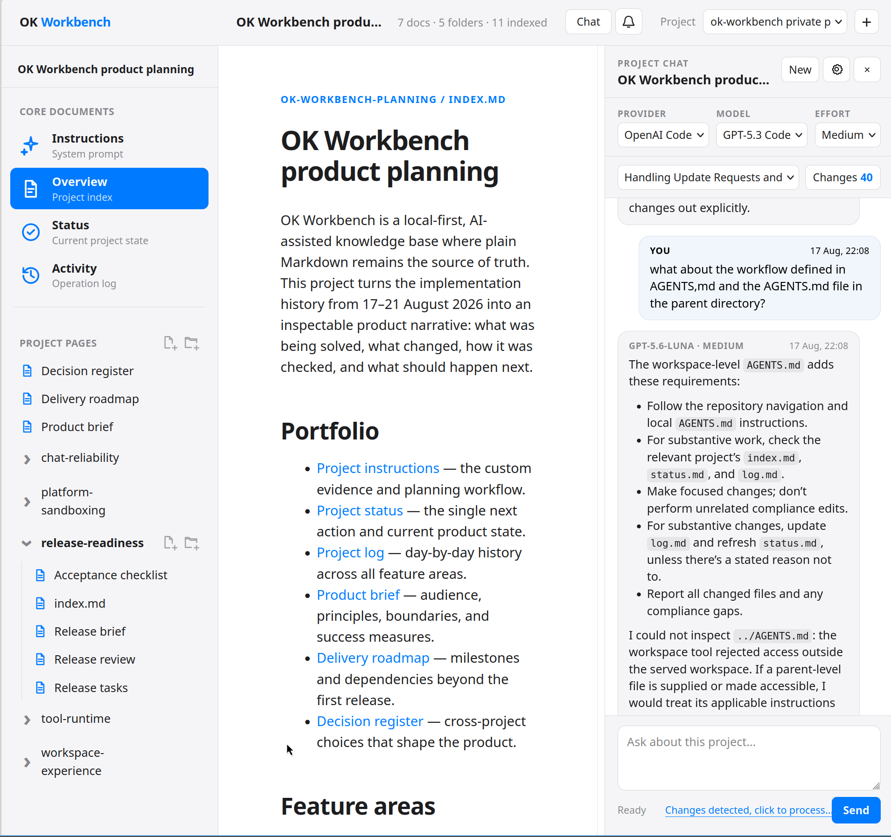
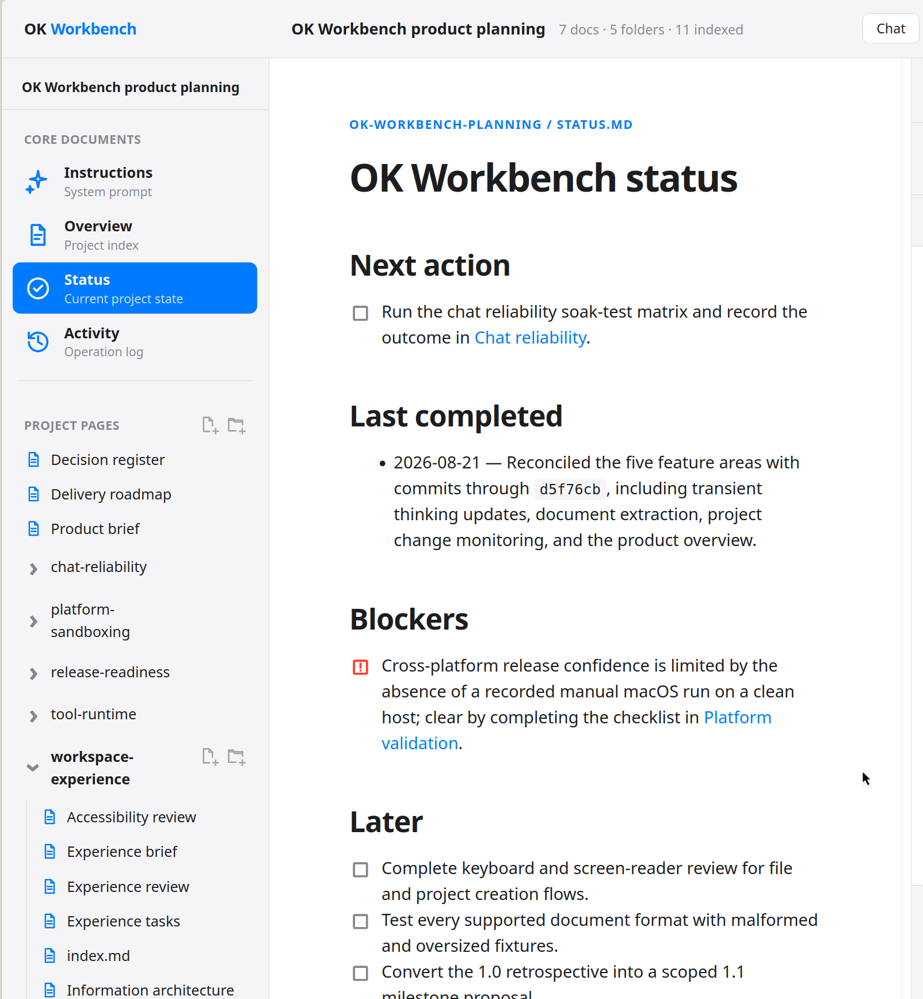
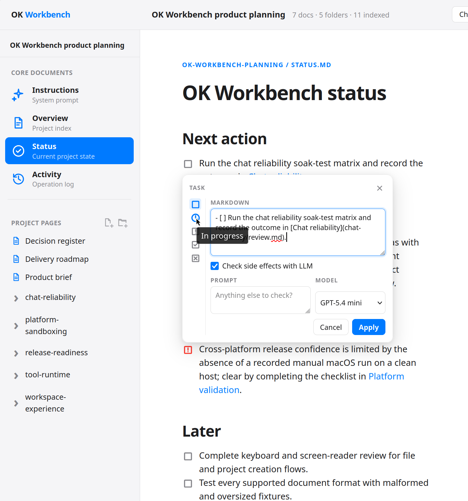
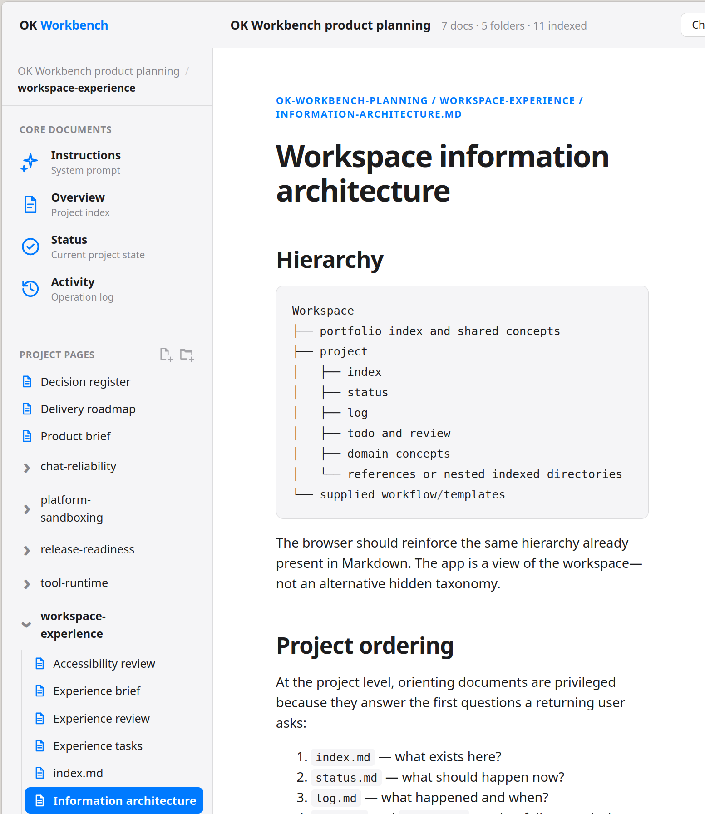
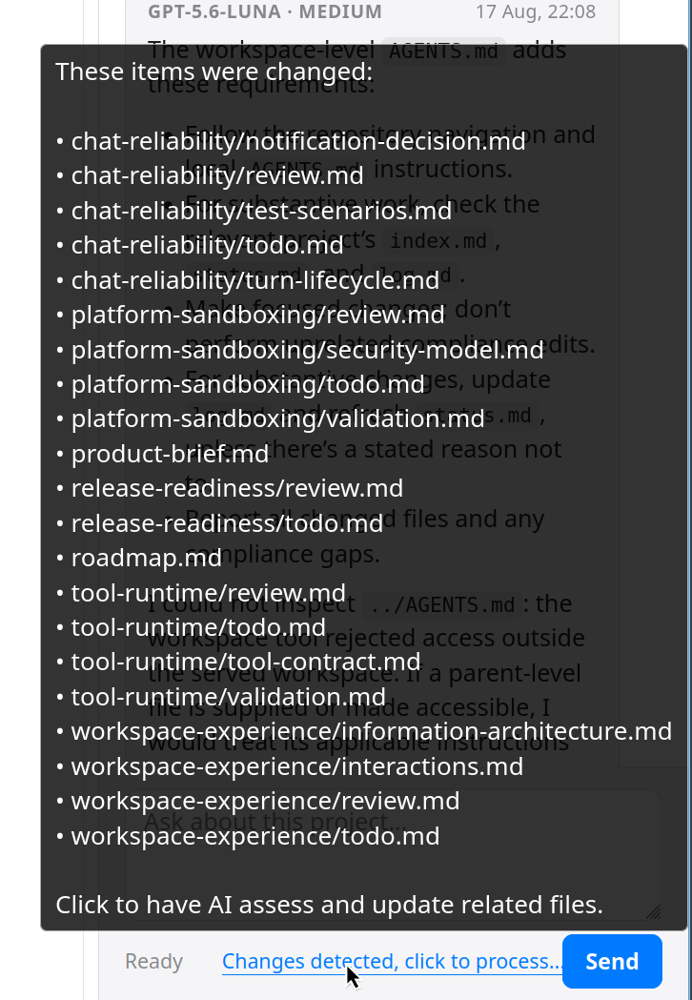
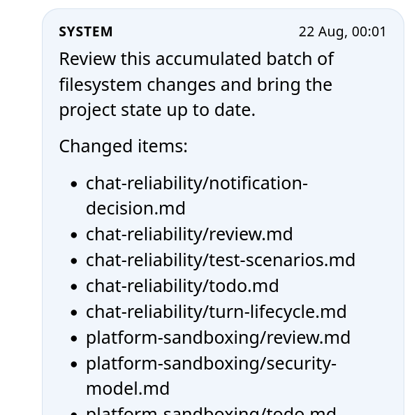
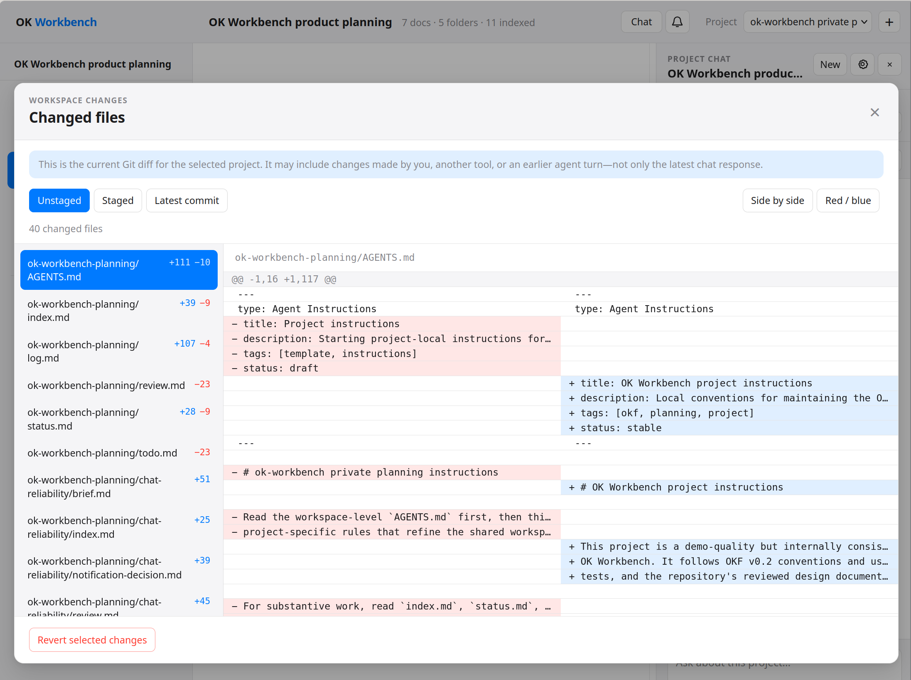

# What is OK Workbench?

OK Workbench is a **local, multi-project knowledge base where an AI helps keep
the filing up to date**. You talk to a project-scoped assistant; it reads,
writes, and cross-links the relevant documents while keeping current status and
history aligned.

The knowledge itself remains ordinary Markdown on your machine. You can browse
it without configuring an AI, edit it in any text editor, version it with Git,
and move the whole workspace without exporting from a proprietary database.

*A project overview in the centre, its indexed files on the left, and optional
project-scoped chat on the right.*

## Features at a glance

| Feature | What it gives you |
| --- | --- |
| **Living project status** | One next action, the latest completed outcome, blockers, and a short backlog. |
| **Durable activity log** | A dated history that stays useful after a chat session ends. |
| **AI-assisted housekeeping** | Coordinated updates to related project files when plans or facts change. |
| **Local Markdown wiki** | Linked, indexed knowledge that works with or without the application. |
| **Project-scoped chat** | Provider, model, and effort controls with concurrent turns, liveness feedback, cancellation, and notifications. |
| **Task controls** | Change task state in place and optionally ask a model to check related status and log entries. |
| **Git-backed review** | Inspect unstaged, staged, and committed changes with project-relative diffs before keeping them. |
| **Document extraction** | Pull text from PDF, DOCX, PPTX, XLSX, ODT, ODP, and ODS files for indexing and summarisation. |
| **Custom local tools** | Add policy-controlled Python or Node.js scripts for integrations and repeatable workflows. |
| **Sandboxed writes** | File-changing tools fail closed unless the platform isolation backend is available. |

## A workspace that tells you where to resume

OK Workbench is designed as a planning partner or coach. Each project has a
small set of living core documents:

- **`index.md`** maps the project and links to its important concepts.
- **`status.md`** answers “what should I do next?” without making you reconstruct
  the answer from an old conversation.
- **`log.md`** preserves dated detail while status stays concise.
- **`AGENTS.md`** tells the assistant how to work in this particular project.

*Status is deliberately small: one immediate action, one latest outcome,
explicit blockers, and a short ordered backlog.*

The detailed history lives separately in `log.md`. End a session with “log what
we did and update the status,” and the assistant can carry the durable result
forward. On the next visit, it reads the same files you do.

This separation matters. Status is the fast “resume here” view; the log is the
audit trail. If they conflict, the assistant is instructed to flag the gap
rather than inventing a plausible history.

## Update tasks without leaving the page

Task markers in Markdown are interactive. You can move an item between to-do,
in-progress, blocked, completed, and cancelled states, edit its Markdown, and
optionally ask a selected model to check whether the change affects related
tasks, status, or log entries.

*The task remains Markdown; the popover is a focused editor for that source
line, with an optional consistency check afterward.*

## A wiki with an organising spine

Under the planning layer, OK Workbench is a local wiki. The browser turns
ordinary links and directories into project navigation, while the files remain
usable in any editor.

The workspace follows OKF (Open Knowledge Format), a lightweight convention of
indexes, YAML frontmatter, and standard Markdown links. Each directory has an
`index.md`; each concept declares what it is and gives a one-line description.
Indexes point to concepts, and concepts can point onward to source material in
`references/` directories.

*The browser reinforces the hierarchy already present in the files. It does
not create a second, hidden taxonomy.*

That structure gives the assistant a reliable map. It can discover which files
belong together and update a decision, task list, status, and log as one
coherent change instead of leaving stale copies around the project.

## Catch drift, then reconcile it deliberately

Markdown-first projects are often edited by more than one tool. OK Workbench
monitors the selected project for filesystem changes and collects the affected
paths. When it detects drift, it offers to start a project-scoped housekeeping
turn that reviews the accumulated batch and updates related state where needed.

| Detect the changed files | Ask the assistant to reconcile the batch |
| --- | --- |
|  |  |

This is intentionally visible and user-triggered. The file watcher does not
silently rewrite project knowledge in the background; it tells you what changed
and lets you decide when the assistant should assess the consequences.

## Review every change as a Git diff

AI-managed files only work if the AI's work is easy to inspect. The changes
view shows the selected project's unstaged changes, staged changes, and latest
commit. Paths are project-relative, and diffs can be viewed side by side or
inline with different colour palettes.

*The diff may include changes from you, another tool, or an earlier agent turn—not
only the most recent chat response.*

You can unstage a selected file or revert selected working-tree changes from the
same review flow. Git operations use a pathspec scoped to the current project,
so reviewing one project does not turn into a workspace-wide discard operation.

## Chat stays attached to the project

Chat is optional and project-scoped. Each project can retain its own provider,
model, effort, and conversation preferences. Multiple turns can continue at
once while you browse another page or project.

Long-running work has explicit liveness states: tool start/completion, elapsed
time, quiet-period messaging, retry status, and per-turn cancellation. Finished
background turns create notifications that return to the exact response.
Reasoning-model thinking can be shown as transient progress when enabled, but it
is cleared when normal response text begins and is never saved in thread history.

Chat transcripts and provider credentials live in application state outside the
workspace. Browsing the wiki does not require provider credentials at all.

## Bring real project files with you

A Markdown knowledge base still needs to work with reports, spreadsheets, and
slide decks. Store those files beside the project notes and the assistant can
extract text from:

- PDF;
- Word and OpenDocument text (`.docx`, `.odt`);
- PowerPoint and OpenDocument presentations (`.pptx`, `.odp`); and
- Excel and OpenDocument spreadsheets (`.xlsx`, `.ods`).

Extraction is deliberately text-first. It does not promise OCR, layout
understanding, chart interpretation, or faithful document rendering. The useful
pattern is to keep the original file as evidence, extract enough text to search
or summarise it, and link the resulting concept back to its source.

## Extend the workspace with your own tools

Executable Python 3 and Node.js scripts placed in `tools/` or a project's
`tools/` directory become assistant-callable workspace tools. An adjacent JSON
policy controls which existing environment variables the script receives,
whether it may use the network, and how long it may run.

Tools run directly without a shell, with separate arguments, captured output,
and a bounded timeout. Secrets stay in the environment that launches OK
Workbench—not in the workspace or tool policy file.

This provides a controlled path to issue trackers, exporters, fetchers, and
other local automation without turning every chat turn into unrestricted command
execution.

## Local and reviewable by design

Several boundaries keep the model's file access narrower than the application
around it:

- The HTTP server binds to loopback, and mutation endpoints require the in-page
  CSRF token and a loopback origin.
- Workspace paths reject traversal and symbolic-link escape.
- File-changing model tools run inside Bubblewrap on Linux or Seatbelt on macOS
  with a cleared environment, private temporary directory, and no network by
  default.
- If the supported sandbox cannot start, mutating tools are disabled rather than
  run with weaker isolation.
- Git review and recovery actions are scoped to the selected project.

OK Workbench is still a local application, not a security boundary against a
malicious process already running as the same user. The full boundaries and
known limits are documented in the [threat model](THREAT-MODEL.md) and
[macOS sandbox guide](MACOS-SANDBOX.md).

## Who it is for

- **Solo builders and researchers** juggling several long-running projects.
- **People who want AI leverage without opaque AI memory.** Everything durable
  stays in files they can inspect.
- **Anyone who wants a local wiki with an unusually diligent librarian.** Chat
  is helpful, but the knowledge remains useful without it.

## Getting started

See the [README](README.md) for installation and the quick start. In short:

1. Initialize a workspace with `ok-workbench init`.
2. Serve it with `ok-workbench serve`.
3. Open the local workspace in your browser.
4. Browse immediately, or configure a provider and start a project-scoped chat.

The bundled [starter workflow](workflow/index.md) and templates provide a small,
valid structure that you can customise after initialization.
