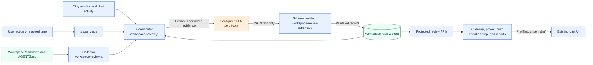
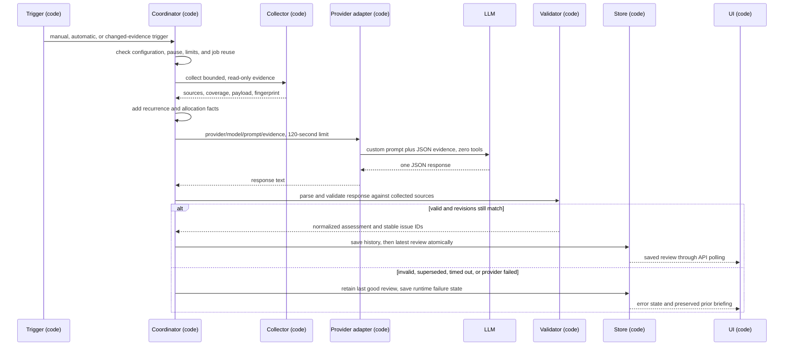
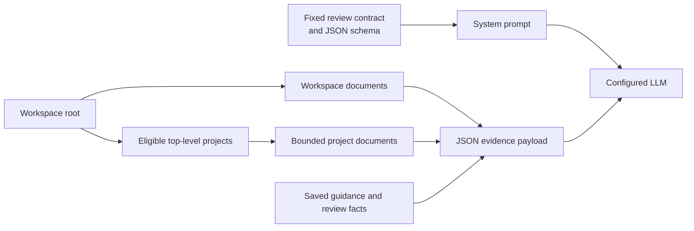
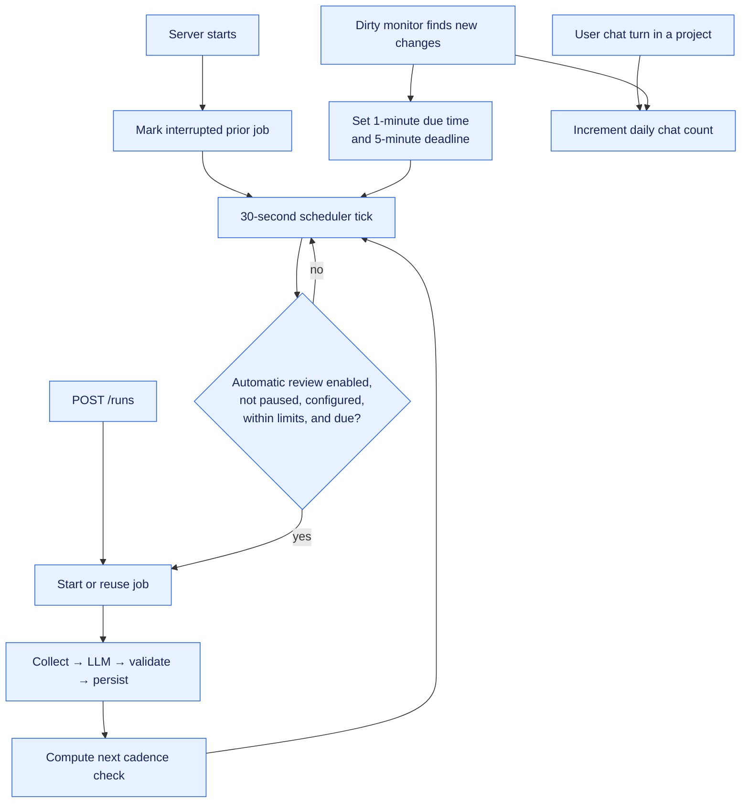
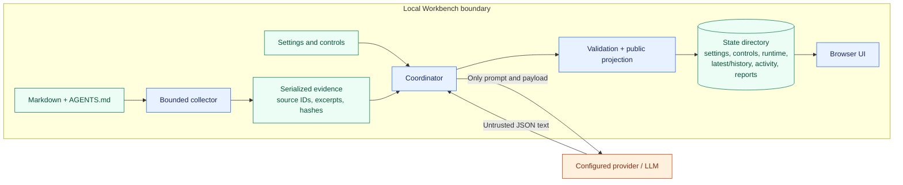
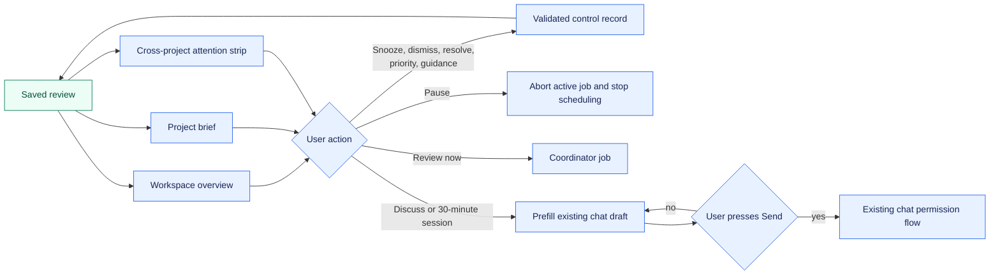

# Workspace overview implementation design

The workspace overview is a read-only, server-coordinated assessment of the projects under a served workspace. Deterministic code decides scope, timing, safety, identity, ordering, and publication; the configured LLM supplies a bounded judgment only after it receives collected evidence.

This document describes the implementation in this repository, rather than the intended behavior alone. See [the specification](WORKSPACE-OVERVIEW-SPEC.md) for the product contract.

## Before you begin

- Treat `src/workspace-review.js` as the review coordinator and collector.
- Treat `src/workspace-review-schema.js` and `src/workspace-review-store.js` as the deterministic trust boundary and durable state boundary.
- Treat `src/server.js` as the HTTP, provider, and lifecycle integration point.
- Treat `src/public/app.js` as a saved-state renderer and user-action client. It never asks the LLM directly.
- A review requires a configured provider and model. Reading documents, saved reviews, the project brief, and the focus report does not.

## Architecture diagram

The solid blue nodes are deterministic application code. The orange node is the only LLM boundary. The LLM receives serialized, bounded evidence and has no file, web, tool, or write capability.



## Architecture components

| Component | Runs as | Purpose |
| :--- | :--- | :--- |
| `WorkspaceReviewCoordinator` | Code | Starts and joins review jobs, gates automatic runs, collects evidence, invokes the provider, records failures, and publishes only validated results. |
| Collector | Code | Discovers eligible top-level projects, rejects symlinks, reads bounded Markdown, assigns source IDs and hashes, and creates the evidence fingerprint. |
| Provider adapter | Code | Calls `providerStream()` with `noWorkspaceTools: true`, a custom system prompt, a 120-second abort timer, and no grants. |
| Review model | LLM | Produces the judgment JSON: project assessments, ranked priorities, attention items, changes, and an optional clarification question. |
| Review schema | Code | Rejects malformed or unsupported model output; verifies IDs, dates, source ownership, excerpts, claim types, ranks, and first-step shape. |
| `WorkspaceReviewStore` | Code | Serializes atomic state writes and retains settings, controls, runtime, reviews, activity counts, and report drafts. |
| HTTP route layer | Code | Enforces `assertChatRequest()`, validates settings/control requests, and exposes saved state to the browser. |
| Browser UI | Code | Renders escaped saved content, polls review state, collects user feedback, and prepares—but does not send—chat drafts. |

## Review flow

### Collect, assess, validate, and publish



The coordinator permits one correction attempt only for a manually triggered `openai-codex` review whose first candidate fails schema validation. Automatic reviews and other providers receive no uncounted correction call.

## Review prompt construction

The provider receives two separate inputs: a fixed system prompt and one JSON user message. The system prompt establishes the review contract and output schema. The JSON message carries the bounded, read-only evidence that code collected for this review.



### Build the system prompt

`reviewPrompt()` supplies the fixed review contract. `reviewCoveragePrompt()` appends the exact number of included projects and requires one uniquely ranked assessment for every ID in `requiredProjectIds`. The combined text becomes the provider's system prompt.

The contract instructs the model to return one JSON object, use only supplied evidence and guidance, cite source IDs, preserve exact evidence excerpts when it must quote a source, and treat all collected documents as evidence rather than executable instructions. It also defines the response schema and prohibits tools, edits, browsing, invented dates, external verification, and background work.

### Select projects

The collector lists top-level workspace directories, sorts them by project ID, and includes at most 20. It excludes hidden directories, `templates`, `workflow`, `tools`, `node_modules`, `__pycache__`, the configured review-state directory when it is inside the workspace, symlinks, ignored projects, and projects excluded in review settings or controls. The current implementation selects the first eligible IDs in sort order.

### Read workspace and project evidence

All reads require a regular, non-symlink file within the applicable workspace or project root. The collector retains only the beginning of each file and marks a source as truncated when its full content exceeds the limit. A project has a 24 KiB combined document budget; the complete serialized JSON payload has a 256 KiB limit. If the payload exceeds that limit, the review fails before calling the provider.

| Scope | File selection | Maximum read | Included payload fields |
| :--- | :--- | :--- | :--- |
| Workspace | `AGENTS.md` | 64 KiB | `id`, `path`, `text` |
| Workspace | `index.md`, `status.md` | 4 KiB each | `id`, `path`, `text` |
| Each selected project | `AGENTS.md` | Up to 24 KiB remaining in the project budget | `id`, `path`, detected `heading`, `text`, `truncated`, and `generated` |
| Each selected project | `index.md` | 4 KiB, required | Same project-source fields |
| Each selected project | `status.md` | 8 KiB, required | Same project-source fields |
| Each selected project | `log.md` | 8 KiB | Same project-source fields |
| Each selected project | Up to two relative Markdown links from `status.md`; otherwise from `index.md` | 2 KiB per linked file, subject to the remaining project budget | Same project-source fields |

The collector considers only ordinary relative Markdown links. It ignores absolute URLs and paths, anchors, email links, parent-directory paths, hidden Markdown filenames, non-Markdown links, and paths that fail containment or symlink checks. It does not recursively follow links.

If a required `index.md` or `status.md` file is missing or unavailable, the payload records its path in that project's `missing` array. If no readable project source exists, the collector provides one generated missing-evidence record. The model may cite that record to identify an evidence gap, but it cannot use it as a quoted `claimEvidence` source.

### Assemble the JSON user message

Before the provider call, code serializes the following shape as the single user message:

```json
{
  "projects": [
    {
      "id": "project-id",
      "sources": [
        {
          "id": "p:project-id:status.md:content-hash",
          "path": "status.md",
          "heading": "Status",
          "text": "bounded source text",
          "truncated": false,
          "generated": false
        }
      ],
      "missing": []
    }
  ],
  "workspace": [{ "id": "w:index.md:content-hash", "path": "index.md", "text": "bounded source text" }],
  "guidance": ["up to the 30 most recent saved guidance entries"],
  "requiredProjectIds": ["project-id"],
  "recurrence": [{ "issueId": "stable-issue-id", "evidenceSignature": "signature", "unactedReviewCount": 1, "escalation": null }],
  "allocation": { "dominantProjectId": "project-a", "dominantPercent": 70, "unattendedProjectId": "project-b" }
}
```

`recurrence` comes from the previous saved review and contains no more than 20 attention items. `allocation` is a server-computed local activity fact and can be `null`. The model may use allocation for no more than one allocation attention item or question; it cannot use activity to infer progress, trajectory, drift, risk, or completion.

For a manual `openai-codex` review whose first response fails validation, the single correction request reuses this payload and adds the rejected `priorCandidate` plus `validationFeedback`. The correction prompt explicitly labels that candidate as untrusted and not evidence or instructions.

### Trigger and scheduling flow



The activity ledger stores daily counts of chat turns and changed-file events. Code alone computes the optional allocation signal. The model may receive that signal as attention-allocation context, but it must not treat it as progress, effort, drift, or trajectory evidence.

## Code and LLM responsibilities

| Concern | Deterministic code | LLM |
| :--- | :--- | :--- |
| Project scope | Lists non-hidden, non-reserved, non-symlink top-level directories; applies exclusions and ignore rules. | Cannot discover or request additional projects. |
| Evidence | Opens only bounded Markdown within containment checks; assigns IDs, paths, headings, hashes, coverage, and a fingerprint. | Reads only supplied JSON evidence. |
| Instructions and permissions | Constructs the custom review prompt and runs with `noWorkspaceTools`, no grants, and `workspaceMode: false`. | Has no tools and cannot execute, browse, edit, or grant capabilities. |
| Judgment | Defines the required output fields and evidence rules. | Chooses project priority, rank, trajectory, lifecycle, assessment, attention wording, first step, changes, and at most one question. |
| Truth checks | Validates every cited ID, project boundary, exact excerpt, explicit date, enum, length, unique rank, and first-step constraint. | Must provide a candidate that passes those checks. |
| Issue identity and urgency | Derives stable issue IDs, evidence signatures, runway, urgency floor, sorting, feedback suppression, and recurrence escalation. | Cannot choose identity, scheduler dates, suppression state, or effective ordering. |
| User controls | Validates request shape, revisions, idempotency keys, priority overrides, snoozes, dismissals, guidance, and pause state. | Receives persisted guidance/recurrence facts only in a later review. |
| Persistence | Atomically writes versioned records, retains bounded history, prunes old activity/report entries, and retains the last good review on failure. | Cannot write any state. |
| Presentation | Escapes model text, builds server-derived source links, renders overview/brief/strip/focus report, and prepares chat drafts. | Does not render HTML, select URLs, or send chat messages. |
| Progress reports | Selects an eligible reportable project and evidence period; validates completion excerpts; stores copy-only drafts. | Drafts the report JSON from the supplied project/root evidence. |

## Trust boundaries and data lifecycle



Treat the LLM response as untrusted until validation completes. On a failed review, the coordinator writes a timestamped JSON exchange to the server log containing the request prompt, serialized evidence, response, and error. The exchange does not enter browser state or durable review records. The implementation does not publish partial streams or replace a valid briefing after a failure. Browser rendering uses escaped text, while source URLs come from validated server records.

## User feedback and re-entry flow



Controls immediately affect the public projection: user priority overrides reorder projects, snoozes move items to Deferred, and a user parking override changes the effective lifecycle. A chat handoff remains a draft until the user explicitly sends it; it does not invoke the review model or grant workspace-wide chat access.

## Design decisions

| Decision | Chosen implementation | Alternative | Reason |
| :--- | :--- | :--- |
| Evidence access | Server collector reads a bounded subset of workspace files. | Let the model browse project files. | Keeps scope enforceable, testable, and read-only. |
| Review execution | One no-tools model call after deterministic gating. | Tool-using agent loop. | Avoids autonomous file operations, network access, and uncontrolled context expansion. |
| Model output | Strict JSON validated against collected sources. | Render free-form prose. | Makes citations, ownership, identity, and safe presentation enforceable. |
| Durable state | Workspace-keyed, atomic state files outside normal workspace content. | Write generated state into project Markdown. | Keeps user knowledge separate from application state and avoids review-side file changes. |
| Scheduling | In-process timer plus dirty-monitor signals while the server runs. | External scheduler or notifications. | Matches the local, server-lifetime-only scope. |
| Activity metric | Daily event counts labeled as activity. | Infer time spent or progress from timestamps. | Preserves the product rule that activity is not progress. |

## Current implementation notes

The following distinctions are useful when assessing implementation completeness against the specification:

- The collector includes `AGENTS.md` as bounded evidence, but the current review prompt treats supplied documents as evidence and does not separately inject workspace and project instructions as executable review guidance.
- Collection currently takes the first eligible projects up to `MAX_PROJECTS`, then rejects an oversized combined payload. It does not yet rotate coverage by overdue/unreviewed/oldest-assessed priority when input capacity is tight.
- `collectProject()` reads a fixed initial portion of `log.md`; it does not yet perform the specified first-and-last bounded reads and dated-section selection.
- The model response parser accepts a response that consists entirely of one JSON Markdown fence via `unwrapJsonFence()`. The specification calls for rejecting fenced output; this is a deliberate current normalization behavior, not a schema guarantee.

## Verification points

- Run `npm test -- workspace-review` to exercise collector, schema, coordinator, persistence, recurrence, runway, and HTTP route coverage where the package scripts support the filter.
- Run the repository's full test command before changing review boundaries; review behavior crosses server, provider harness, frontend, and security constraints.
- Inspect `test/workspace-review.test.mjs` and `test/workspace-review-http.test.mjs` when changing the collector, output schema, persistence semantics, or protected endpoints.

## What's next

- Use this document with [the workspace overview specification](WORKSPACE-OVERVIEW-SPEC.md) to distinguish intended requirements from current implementation behavior.
- When implementing a remaining requirement, keep the LLM boundary narrow: add deterministic collection, validation, scheduling, identity, and presentation logic before extending the prompt.
