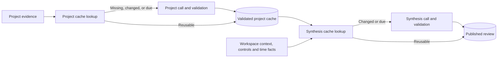

# Implement cached per-project workspace reviews

Split workspace review into independently cached project assessments and a cached workspace synthesis. Refresh only changed or due judgments, and preserve useful results when a project or synthesis fails.

Status: implementation specification, 2026-09-23. Target implementation model: `gpt-6-luna`; this does not prescribe the runtime review model. The runtime implementation and deterministic acceptance suite pass as of 2026-09-23. No live-model reliability claim is made. Use the acceptance criteria below as the completion gate, not as examples to skip after a nominally successful staged run.

This document supersedes [WORKSPACE-OVERVIEW-SPEC.md](WORKSPACE-OVERVIEW-SPEC.md) for review orchestration, caching, call accounting, correction attempts, and partial results. Preserve its other product, evidence, security, and feedback rules.

## Before you begin

- Read `src/workspace-review.js`, `src/workspace-review-schema.js`, `src/workspace-review-store.js`, review routes and provider adapter in `src/server.js`, `src/pi-harness.mjs`, and overview rendering in `src/public/app.js`.
- Read the review unit, fixture, HTTP, and end-to-end tests listed in the implementation sequence below.
- Use the existing Node.js server, plain JavaScript frontend, app-state directory, and atomic storage helpers. Add no runtime dependencies, maintained summary files, distributed queues, or model tools. Do not edit `dist/` directly.
- Use fake providers and an injected clock for automated acceptance. Live model evaluation requires credentials and remains separate from deterministic tests.

## Problem

The workspace review (`src/workspace-review.js`) is one provider call: the
full collected portfolio in, one strict JSON object out — every project
assessment, one global rank, attention items, and at most one question. On a
large real workspace the observed failure rate exceeded 50%, surfaced as
`The selected model did not return valid review JSON`. One malformed response
voids the entire review, and automatic runs get no correction attempt (the
single correction retry applies only to manual runs on `openai-codex`).

## Evidence

Measured on a real 12-project workspace, 2026-09-22:

- Collected evidence was ~152 KB against the 256 KB `INPUT_LIMIT`.
- Successful runs took 59–137 s against the 120 s `REVIEW_TIMEOUT_MS`; the
  137 s run survived only because the manual Codex correction retry carries
  its own timeout.
- `REVIEW_MODEL_TIERS` lists no verified tier for the review model in use
  (`openai-codex/gpt-5.6-terra`); the investigation recorded no fixture results for it.
- Runtime state showed automatic-retry exhaustion (`retry.count: 2`) against a
  single evidence fingerprint.
- Failures were undiagnosable after the fact: the bounded head/tail preview
  went to the server console only, and rejected model output is (correctly)
  never persisted.

## Preserve persisted failure shape

`responseShape()` in `src/workspace-review.js` computes a rejected response's
**content-free shape**: byte count, opening marker (`{`, code fence, or other
text), closing marker (`}`, fence, or other text, possibly truncated), and
fence-marker count. The coordinator persists this shape in
`runtime.lastJob.error.detail`, exposes it through review state, and displays
it in the overview error banner. It distinguishes an empty reply, a truncated
reply, and a prose-wrapped reply without echoing model text, so the spec rule
that rejected output is never persisted still holds. The full head/tail
preview remains console-only.

## Establish the implementation contract

The current collector hashes project sources, but `state()` uses those hashes only to display evidence freshness. Every review still sends the portfolio through one call. Also, the current correction block catches validation failures but not JSON parse failures. Address both limitations.

Required outcomes:

- A cold manual review of N selected projects makes N project calls and one synthesis call, before bounded corrections.
- A fully current review with no pending retry or due trigger makes zero provider calls, including after restart.
- A change to one project's selected evidence refreshes that project and synthesis only.
- Changes to workspace allocation, feedback, and priority reuse document assessments.
- A failed project does not discard successful project results. A failed synthesis does not discard project caches or replace the last good briefing.

Keep the 20-project synthesis ceiling for this implementation. Select fairly and disclose omissions; removing that ceiling requires a separate synthesis design. Per-project calls remove the aggregate raw-evidence bottleneck for selected projects, not every portfolio limit.

## Separate assessment from synthesis



| Component | Responsibility |
| :--- | :--- |
| Collector | Secure bounded reads, deterministic fingerprints, coverage and evidence gaps. |
| Project assessor | One project's documented outcome, trajectory, lifecycle, blocker, next action, cadence, and attention candidates. |
| Synthesis | Global priorities and rank, focus, up to three attention items, changes, and at most one question. |
| Coordinator | Cache planning, attempt limits, failure isolation, cancellation, and publication guards. |
| Store | Independent validated project records and published reviews. |
| Public projection | Overrides, suppression, deadline runway, and freshness without provider calls. |

### Define the stage contracts

Extract reusable validators from `validateReview()`. Add `validateProjectAssessment()` and `validateWorkspaceSynthesis()` rather than constructing artificial single-project reviews. Retain a final assembled-review invariant check.

The following type notation references `ModelReview` in the overview specification. Use its existing field limits, with the current runtime schema's `claimEvidence` on attention items and `allocation` kind also supported. Require `claimEvidence` arrays even when empty. Reject unknown fields at every level.

```ts
type ProjectAssessment = Omit<ModelReview["projects"][number],
  "priority" | "rank" | "priorityReason">;

type ProjectResult = {
  assessment: ProjectAssessment;
  attentionCandidates: ModelReview["attention"]; // 0..3; no allocation kind
};

type WorkspaceSynthesis = {
  headline: string;
  summary: string;
  focusProjectId: string | null;
  evidenceIds: string[];
  changes: ModelReview["changes"]; // 0..3
  priorities: Array<{
    projectId: string;
    priority: "focus" | "next" | "maintain" | "parked";
    rank: number;
    priorityReason: string;
  }>;
  attention: ModelReview["attention"]; // 0..3
  question: ModelReview["question"];
};
```

Give stage 1 only its project's sources, workspace instructions/root context, effective global guidance, project-scoped guidance, and review date/timezone. Do not supply other projects, activity allocation, portfolio ranks, recurrence, or priority overrides. Priority overrides belong to synthesis/projection; cadence overrides belong to scheduling. Stage 1 describes current evidence, not changes since its prior result; synthesis owns that comparison.

Require exactly the requested project ID. Project assessment and candidate document citations must belong to that project. Guidance can explain preferences but cannot prove documented completion. A lifecycle claim, consequence, or date must quote original project evidence; each claim source must also appear in the enclosing object's `evidenceIds`. Reject cross-project claims and generated sources as claim quotes. Preserve exact-substring checks, concrete `firstStep` validation, and real-calendar-date checks. Accept only explicit ISO dates in this iteration, matching the current prompt.

Give synthesis each validated assessment/candidate set, original assessment time, freshness/fallback reason, and a bounded evidence pack. The pack contains original source IDs/metadata, exact claim/date excerpts, and bounded source excerpts used by the assessment and candidates. These remain original-document extracts, not new summary sources. Validate synthesis quotations against both the supplied pack and the retained original source snapshot.

Also supply workspace root context, active guidance, effective priority overrides, suppression, server-computed recurrence/allocation, and a bounded comparison projection from the last published review. Limit comparison context to 16 KiB; omit optional changes when supporting comparison evidence cannot fit. Never silently drop essential active guidance.

Synthesis cannot rewrite stage-1 trajectory, lifecycle, confidence, outcome, or assessment. Merge priority fields on the server. Require exactly one priority entry per selected project and ranks exactly `1..N`, without gaps or duplicates. Validate focus membership. Enforce at most one allocation observation across attention and question; activity cannot support progress or trajectory claims.

Only current validated project records can support a new substantive attention item, focus recommendation, or improvement claim. For stale/unavailable projects, allow generated evidence-gap facts to support an update request or clarification. Retain old assessments for display with original timestamps; do not present them as current corroboration. If no project supports focus, return null and an honest insufficient-evidence briefing.

## Cache by actual dependencies

Use SHA-256 over canonical JSON with recursively sorted object keys. Sort unordered collections deterministically; preserve meaningful ordering such as selected sources and guidance. Hash content and semantic dependencies, not modification times or incidental settings revisions.

A project's `inputKey` includes:

- Project identity in the canonical workspace scope.
- Source IDs, paths, content hashes, truncation flags, missing/unavailable reasons, and selection order. Hash actual bounded model evidence. Changes outside the selected evidence do not invalidate an unchanged selection; coverage must disclose truncation.
- Workspace instruction/root-context hashes and effective global plus project-scoped guidance. Filter guidance by scope before bounding it; replace the blanket `slice(-30)` with explicit size checks that preserve applicable active guidance.
- Provider, model, effective effort, timezone, collector version, project prompt version, and project validator version.

Store `assessedAt` and `nextDueAt` separately. A hit requires a valid compatible record, matching `inputKey`, and `now < nextDueAt`. Never slide timestamps forward on a hit. A forced refresh bypasses reuse without changing the content key.

The synthesis key includes its actual canonical input: selected membership, project result digests and freshness, supplied packs, workspace context, effective controls, allocation and recurrence facts, bounded prior-review comparison projection, provider/model/effort, synthesis prompt/schema versions, timezone, and applicable time-trigger bucket. Exclude job IDs, diagnostic counters, access times, and raw clock seconds.

Prevent self-invalidation: persist the synthesis comparison baseline and consumed trigger token. Until an external change, due event, manual force, or successful project refresh occurs, reuse that baseline/token; do not replace the baseline with synthesis's own output. For a new event, capture the current published review as the next baseline. Repeated reads and unchanged manual requests must not create endless synthesis calls.

### Apply the invalidation matrix

| Event | Project calls | Synthesis behavior |
| :--- | :--- | :--- |
| A's selected evidence/local instructions change | A only. | Refresh after A's result or fallback changes. |
| Timestamp-only change or uncollected file changes | None. | Reuse when collected payload hashes match. |
| A's scoped guidance added/removed | A only. | Refresh. |
| Global guidance or workspace instructions/root context change | All selected projects become dirty. | Refresh subject to budget, with explicit fallbacks. |
| Priority override or expiry | None. | Apply projection immediately; refresh synthesis. |
| Feedback, snooze expiry, allocation fact change | None. | Apply suppression immediately; refresh if effective input changes. |
| Cadence override | Recompute due time from original assessment; call only if due. | Refresh only if supplied facts change. |
| Project cadence expires | That project only. | Refresh after its attempt. |
| Explicit deadline enters seven-day window or local date changes within it | Relevant project due, at most once per local day. | Refresh time-sensitive synthesis; compute runway locally. |
| Provider/model/effort or shared collector/validator changes | All selected projects dirty. | Invalidate. |
| Synthesis-only prompt/schema change | None. | Invalidate. |
| Exclusion, deletion, rename, ignore-rule change | New identities miss; unchanged identities retain caches. | Change membership; redact removed projects immediately. |
| Automatic toggle, daily limit, reportable flag | None from the setting itself. | Reuse. |
| Activity tracking toggled | None. | Invalidate only if supplied allocation changes. |
| Timezone changes | Conservatively invalidate all selected projects. | Invalidate. |
| Default manual Review now | Missing, dirty, or due projects only. | Reuse when current. |
| Explicit manual Reassess all | Bypass caches for selected projects. | Force once. |

Use daily/weekly/monthly intervals of 24 hours, seven days, and 30 days from successful assessment. Cadence overrides change the interval, not the original timestamp. Evaluate deadline and expiry triggers in the saved timezone. A failed due refresh remains due but obeys backoff. Missing evidence does not cause an immediate retry loop.

This is an inference cache, not a filesystem-read cache. Reconcile evidence locally on the existing monitor tick and before dispatch/publication. GET requests can calculate freshness but never call a provider.

## Persist independent project records

Add `projects/<sha256(projectId)>.json` below the existing workspace-scoped store. Do not interpolate raw project IDs into new paths. Keep one latest successful record per project, with atomic rename, restrictive permissions, and workspace-serialized writes.

| Field | Type | Required | Description |
| :--- | :--- | :--- | :--- |
| `schemaVersion` | Integer | Yes | Separate project-cache format version, initially 1. |
| `projectId`, `inputKey`, `resultDigest` | Strings | Yes | Server identity, dependency key, digest of validated normalized result. |
| `assessedAt`, `nextDueAt` | Timestamps | Yes | Original successful assessment and due time. |
| `provider`, `model`, `effort` | Strings; effort nullable | Yes | Provenance with effective effort. |
| `versions` | Object | Yes | Collector, prompt, validator versions. |
| `result` | Object | Yes | Validated `ProjectResult`. |
| `sources`, `coverage` | Array, object | Yes | Bounded source snapshots and gaps needed to validate/display the record. |

Validate cache records against stored sources and versions on read. Corruption/incompatibility is a miss. Never overwrite a good record with a failure, placeholder, partial stream, or superseded result. Persist successful project records before synthesis so restart and synthesis failure retain the work.

Add an optional `pipeline: { version: 2, ... }` envelope to published records containing synthesis key/baseline/trigger and per-project provenance. Preserve existing assessment fields. Keep settings, controls, activity, and report schemas at version 1; do not bump the shared `SCHEMA_VERSION` and reset user data. Load legacy reviews for display/history but do not seed project caches from portfolio judgments missing the new dependency contract. Build caches lazily.

Persist retry state by stage/target: project ID plus input key and due/force token, or synthesis key. Keep at most 500 retry entries, pruning expired entries first. Prune project caches after 30 days of continuous ineligibility, using server-owned timestamps; redact them immediately from public responses. Keep current review-history retention. Cache maintenance never edits workspace documents.

## Orchestrate bounded work

1. Snapshot settings, controls, membership, evidence, and time triggers. Deduplicate concurrent requests into one workspace job.
2. Select at most 20 projects: never-assessed first, then due/dirty by oldest successful assessment, then remaining by oldest successful assessment; break ties by ID. Place targets with exhausted retries or active backoff after runnable targets so failures cannot monopolize selection. Show retained omitted rows as **Not included in this review**, with original timestamps. Their old ranks do not participate in the new `1..N` ordering.
3. Classify cache hits, refreshes, and targets blocked by backoff/budget. Allocate capacity before dispatch. Use concurrency at most 2, one call per project at a time, and a shared job abort signal.
4. Before committing each project success, recheck its dependency key and eligibility. A change to another project does not invalidate an otherwise valid result. Stop scheduling on pause/provider changes.
5. Build synthesis from current results and explicit fallbacks. Reuse when key/trigger match; otherwise call and validate within remaining budget.
6. Before publication, recheck synthesis dependencies, membership, settings/controls revisions, and project keys. On supersession, retain the last briefing, keep independently valid project caches, and set one pending rerun. An older job must not clear a newer pending-change flag.
7. Save history then latest atomically. Record completion/partial status, stage counts, and next due event. With automatic review off, expose stale state for another explicit request rather than silently rerunning.

### Preserve the automatic cost limit

Keep `dailyAutomaticLimit` as a rolling 24-hour provider-call limit, default 6, not a job limit. Every project, synthesis, and correction dispatch consumes one attempt. Durably reserve an attempt before dispatch, including across concurrent workers; a crash may conservatively consume a reservation. Local checks cost no attempts.

When synthesis is expected, reserve one available attempt for it before scheduling projects. With six attempts and 12 cold projects, assess at most five and synthesize over those results plus unknown placeholders. Later eligible runs rotate unfinished projects. With one attempt, allow synthesis using existing results/fallbacks; with zero, use local projection only. Keep the 15-minute minimum between automatic jobs, not between calls within one job.

Preserve saved automatic opt-in and metered-provider confirmation. Update settings copy to explain multiple calls within the saved cap; do not add repeated approvals. A manual review authorizes bounded fan-out for selected projects and bypasses automatic rate/daily limits. Show planned reuse/refresh counts and maximum calls. A cold 20-project manual run has a ceiling of 42 calls including one correction per request.

### Bound each request

| Boundary | Requirement |
| :--- | :--- |
| Project input | 128 KiB serialized UTF-8 including prompt, 24 KiB project evidence, workspace context, guidance, correction overhead. |
| Synthesis input | 256 KiB including prompt; at most 8 KiB per-project evidence/result pack. |
| Project response | 16 KiB text. |
| Synthesis response | 64 KiB text. |
| Call timeout | 120 seconds including streaming; correction is a separate attempt. |
| Job deadline | 30 minutes; abort remaining calls and retain validated caches. Preserve previous briefing if synthesis has not published. |

Keep workspace `AGENTS.md` complete within its 64 KiB limit. Never truncate instructions, JSON, essential guidance, or an exact claim excerpt midway to fit. Deduplicate sources and trim optional context first; if required content cannot fit, expose a coverage/error reason. Validate prompt-plus-payload bytes before every dispatch, including corrections.

Update model context-fit checks for the larger stage requirement plus output allowance. Preserve explicit model-tier policy; fake fixtures do not establish live model capability.

Wire the existing 16,384-token output allowance through `workspaceReviewProvider`, `providerStream`, and `runPiTurn` using the installed library's supported mechanism. Clamp to model limits and expose a diagnostic when enforcement is unavailable. Keep byte/timeout guards. Verify the installed API rather than guessing an option name. Do not silently lower configured effort.

## Handle errors and partial results

Keep current normalization: whitespace and one entire JSON fence only. Do not extract JSON from arbitrary prose. Allow one correction after parsing or schema validation fails, for manual and automatic reviews on all providers. Automatic corrections need spare unreserved capacity and cannot consume the synthesis reservation. Keep rejected candidates in memory only; skip correction if the candidate plus feedback cannot fit. Do not correct transport failures, timeouts, cancellation, or oversized output.

After an initial stage attempt and optional correction fail, allow one later automatic retry after 30 minutes for the same target/key/trigger. After that retry fails, wait for changed dependencies, a new due trigger, or manual action. Manual retry does not refresh healthy cache hits. Reset failure state only for its successful target or new key/token. Replace the workspace-wide invalid-review blocking streak with target-scoped failure state: one bad project must not pause healthy projects. Provider-wide authentication/configuration failures can still stop dispatch.

| Condition | Required behavior |
| :--- | :--- |
| Project fails | Retain compatible prior record as stale with original sources/time; otherwise use an unknown placeholder. Continue other projects. |
| No compatible prior record | Server placeholder: low confidence, unknown trajectory/lifecycle, null blocker/next action, no claims/candidates, explicit unavailability reason, generated evidence-gap source. Do not count it as validated assessment. |
| Budget/backoff prevents refresh | Same fallback, with explicit `budget`/`backoff` reason. |
| Collection unavailable | Record the project gap; never treat as unchanged evidence. |
| Synthesis fails | Retain previous briefing and successful caches. On first use, expose project progress without claiming a completed briefing. |
| No eligible projects | Zero calls; redact current projection and show empty state. |
| Pause/shutdown/supersession | Abort calls; reject late publication; keep committed valid caches and attempt counts. |
| Corrupt cache | Refresh only that project; other caches remain usable. |

For stale fallback compatibility, require the same project identity, valid cache schema, and stored evidence validation. Provider/guidance/content changes may make it stale without erasing historical display value. Incompatible schema means unavailable, not an unvalidated fallback.

Persist safe error code, stage, project ID, timestamp, and content-free `responseShape()` only. Do not persist raw provider errors or validator text that echoes model excerpts. Keep previews console-only and out of state responses.

Count recurrence opportunities, not cache reads or recovery calls. Persist a per-project cadence-window opportunity token; increment an eligible issue at most once per token and only on successful synthesis publication. Cache hits, manual force, corrections, and failed syntheses must not mint additional opportunities. Preserve resets on evidence signature changes and user responses. Do not let the recurrence ledger's post-publication update trigger immediate synthesis self-invalidation.

## Expose progress and freshness

Keep existing endpoints. Extend `POST /api/workspace-review/runs` with optional `{ "force": true }`; omitted/false means incremental review. Accept the existing empty request body. Reject other fields/types. Use it for **Reassess all**; keep **Review now** incremental. Preserve request protection and concurrent-job deduplication.

| Field | Type | Required | Description |
| :--- | :--- | :--- | :--- |
| `job.phase` | String or null | Additive | `collecting`, `assessing`, `synthesizing`, or null. |
| `job.progress` | Object | Additive | Selected total, reused, refreshed, failed, deferred, planned maximum calls, calls consumed. |
| Project `assessmentState` | Enum | Additive | `current`, `stale`, `unavailable`; separate from `evidenceState`. |
| Project `assessedAt`, `nextDueAt` | Timestamp or null | Additive | Original assessment time and deadline. |
| Project `refreshReason` | String or null | Additive | Changed evidence, cadence, failure, budget, backoff, or other safe reason. |
| `review.partial` | Boolean | Additive | Eligible projects omitted or without current validated assessments; source completeness remains separate. |
| `projectErrors` | Array | Additive | Bounded safe errors; synthesis errors use existing top-level error. |

Render progress such as **8 reused · 2 refreshed · 1 failed · 1 deferred**. Distinguish **Last assessed** from synthesis completion. During refresh, retain the old briefing. If synthesis fails after project successes, expose newer cache status separately; do not splice new assessments into old published priorities.

Redact deleted/excluded projects from nested assessment, focus, changes, questions, sources, errors, strip, and brief, not just visible rows. Suppress a top-level synthesis sentence that depends on removed data until a safe replacement exists.

## Implement in verifiable steps

1. Extract validators/prompts in the review modules; small focused new modules are acceptable. Test quote ownership, candidate limits, and global ranking.
2. Add canonical keys, cache records/read validation, retries, and additive legacy loading to the store. Test restart reuse and atomic persistence.
3. Refactor collection to avoid the aggregate raw portfolio limit. Add scoped guidance, fair selection, bounded synthesis packs, and stage context checks.
4. Replace `#perform()` with project fan-out and cached synthesis. Refactor `#automatic()`, `nextCheck()`, recurrence, attempt reservations, and publication guards.
5. Wire provider token limits/corrections through the server and harness; preserve no-tool execution and cancellation.
6. Extend run/state routes and overview controls. Keep project reports independent; collector changes must not force reports through synthesis.
7. Update `test/workspace-review.test.mjs`, `test/workspace-review-http.test.mjs`, `test/workspace-review-fixtures.test.mjs`, `test/fixtures/workspace-review-portfolios.mjs`, `test/pi-harness.test.mjs`, and `test/e2e/workspace-overview.e2e.mjs`. Dispatch fake-provider results by explicit stage metadata, not fragile prompt matching.
8. Run focused review/harness tests, `npm test`, and workspace overview end-to-end tests. Align conflicting overview-spec sections with the implementation. Report remaining gaps; do not claim live-model reliability from fake fixtures.

### Verify acceptance criteria

Treat this section as the completion gate. Test through the real collector, coordinator, store, HTTP route, and public projection with a deterministic fake provider. Record every provider dispatch as `{ stage, projectId, promptBytes, evidenceBytes, attemptNumber }`; count correction calls separately. Use an injected clock, a three-project workspace named A/B/C with bounded Markdown sources, and a temporary app-state directory unless a row specifies another setup. Assert saved records and public state, not only call counts. Do not spend provider credits in automated tests.

A fully current review means every selected project has a matching validated cache entry, none is due or retryable, and the stored synthesis key/trigger matches the actual input. For call-count rows, reset the fake provider's log before each action. Unless a row says otherwise, finish each job before asserting counts. For automatic runs, advance the clock past the 15-minute job interval where needed without advancing a project cadence deadline.

| Scenario and setup | Provider dispatches | Required saved and public result |
| :--- | :--- | :--- |
| Cold manual run with A/B/C | `project:A`, `project:B`, `project:C`, then one `synthesis`; four total. | Three validated caches and one complete published review; all three ranks are unique `1..3`. |
| Run again while fully current, then restart coordinator and run again | Zero for each run. | Same project `assessedAt` values, synthesis ID, and recurrence counts; no new history entry. |
| Change selected text in A's `status.md` | One `project:A`, then one `synthesis`; two total. | B/C input keys, result digests, and `assessedAt` stay identical; A's source hash and assessment timestamp change. |
| Touch A without content change, then edit a file outside the selected evidence | Zero for each action. | All keys, assessment timestamps, and published synthesis ID stay unchanged. |
| Add A-scoped guidance, then change global guidance | First action: A plus synthesis. Second: A/B/C plus synthesis. | Only applicable project keys change for scoped guidance; all project keys change for global guidance. Active guidance appears in dispatched input, with no silent `slice(-30)` loss. |
| Change priority override, effective feedback, allocation, then let a snooze expire | Zero project calls for each action; no more than one synthesis per distinct effective input. | Override and suppression appear immediately through GET, before synthesis; project assessment timestamps stay fixed. |
| Advance A's cadence past `nextDueAt`, leaving B/C before theirs | A plus synthesis. | A gets a new `assessedAt`; B/C remain cached. A cache hit immediately before the boundary makes zero calls. |
| Start with an already evidenced A deadline more than seven days away; advance the clock into its seven-day window, then cross a local midnight within it | Only A plus synthesis for each due local-day token. | No clock-triggered call before the window; no second call within the same local day; runway and urgency use the saved timezone, including the deadline day. |
| Send invalid project JSON for A and valid results for B/C; allow A's correction to fail | At most two `project:A` attempts, one each for B/C, and one synthesis. | B/C caches persist; A keeps its prior assessment marked stale with its original time, or gets an `unknown` placeholder if cold; `review.partial` is true and A supplies no new substantive claim. |
| Start from a published A/B/C review, change all three sources, fail synthesis after their successful refreshes, then retry | Refresh: three project calls plus one synthesis. Retry: synthesis only, subject to stage backoff. | The prior published briefing remains unchanged after failure; all three new project caches survive and appear in the successful retry. In a separate cold-start failure, no completed briefing appears until synthesis succeeds. |
| Start an automatic cold run with 12 projects and a six-call daily limit | Without corrections: five project calls and one synthesis. With corrections: at most six total; every correction replaces a project dispatch slot. | Remaining projects show deferred/unknown or dated stale results; persisted attempts equal actual dispatches; a later eligible run selects unfinished projects. |
| Leave one automatic attempt available with dirty projects | One synthesis at most. | Project calls stay deferred and coverage says why. If no attempt remains, make zero calls and retain local projection. |
| Run two project workers concurrently with one remaining reservable project attempt, then restart after reservation | At most one project dispatch before and after restart combined. | Durable rolling 24-hour count never exceeds the configured limit; the reserved synthesis slot remains available. |
| Change A evidence while A's call is in flight; change controls while synthesis is in flight | Obsolete responses may arrive but cannot publish. | Reject A's obsolete cache commit; retain unrelated valid B/C caches; keep last good briefing and one pending rerun. |
| Exclude or delete A during synthesis; pause during a stream | No dispatch after pause; active stream receives abort. | No late publication and no A data in nested assessment, focus, changes, question, sources, errors, strip, or brief. |
| Force refresh of one project in four separate runs with a whole JSON fence, malformed JSON, prose around JSON, and oversized output | Fence: one successful project dispatch. Malformed: at most one correction. Prose: at most one correction. Oversized: no correction. | Only the exact allowed fence normalizes; rejected output never persists, while content-free response shape and allowlisted validation diagnostics do. |
| Change provider, model, or effective effort on an otherwise current A/B/C review | Three project calls plus synthesis for each distinct configuration. | Old caches remain historical but cannot satisfy the new configuration key. Saved settings and controls survive. |
| Corrupt only A's cache on an otherwise current A/B/C review | A plus synthesis only. | B/C remain reusable; corrupt A never appears as a validated cache hit. |
| Load a legacy latest record and existing settings/controls in a fresh project-cache store | A/B/C plus synthesis on the first new run. | Legacy latest remains readable before that run; saved settings/controls survive; legacy portfolio output never seeds project caches. |
| Return a cross-project quote, generated completion quote, or unsupported date in project output; duplicate rank or missing project in synthesis | Each offending response fails its stage validator and uses at most one correction. | No invalid assessment or synthesis reaches the published review; valid caches from other projects remain usable. |
| Create 25 eligible projects; run two successful manual cycles without corrections | First cycle: 20 project calls plus synthesis. Second: five project calls plus synthesis; reuse 15 project caches. | All 25 have been assessed and appear across the current selected rows and retained not-included rows by cycle two; omitted rows retain original times and **Not included in this review**; no retained old rank enters the new `1..N` ranking. |
| Repeat GETs, incremental cache hits, forced manual refresh, correction, and failed synthesis on one issue | Only specified refresh/correction calls. | Recurrence advances at most once per project cadence opportunity after successful publication; cache reads, forced refresh, and failed synthesis do not advance it. |
| Run all six existing fixture portfolios through both stages | Stage dispatches match the selected project count plus synthesis, barring specified cache hits. | Preserve healthy-but-quiet, busy-but-drifting, deadline, parked, unknown, and competing-priority semantics; original-document quotes continue to validate. |
| POST `/api/workspace-review/runs` with `{}`, `{ "force": true }`, an unknown field, and a non-boolean `force` | Current `{}`: zero calls. Valid force: A/B/C plus synthesis. Invalid bodies: zero calls. | Valid requests return a job or reuse the active one; invalid bodies return `INVALID_REQUEST`; GET never dispatches a provider call. |
| Run a slow A refresh while viewing the overview; then fail A and complete synthesis | Calls follow the staged run and correction limits. | UI shows phase/counts while running, retains prior briefing, then shows A's original assessment time, stale/unavailable status, safe error, and partial coverage. |

Pass the document/security checks as well: reject symlinked or escaping paths during collection, refuse unsupported request fields on `POST /api/workspace-review/runs`, preserve CSRF/origin enforcement, and render provider text as escaped text. Verify that project and synthesis requests stay within their respective byte, response, timeout, and job limits. Confirm the Codex provider path receives the requested output-token bound; if its installed library cannot enforce it, record that limitation as an explicit acceptance gap rather than claiming the gate passed.

Run the focused review, HTTP, harness, and overview end-to-end tests plus `npm test`. All automated acceptance rows and required checks must pass before marking the implementation complete. Record any live-model evaluation separately with model/provider, project count, observed failures, latency, and the number of corrections; deterministic fake-provider results do not establish a live reliability rate.

## Rejected alternative: a maintained per-project precis file

Reject a regularly maintained summary document per project.
`status.md` already fills that role as required, bounded,
template-structured evidence with a `stale_after` marker. A derived summary
would break the exact-excerpt evidence chain (reviews would quote a summary
quoting the project); a regularly refreshed file has fresh timestamps even
when the underlying project receives no attention, hiding exactly the signal the
ADHD-informed attention model must surface; and the maintenance burden lands
on the failure mode the design guards against. The two-stage split delivers
the same distillation as an ephemeral, fingerprint-cached machine artifact
instead of a hand-maintained document.

## Implementation status

The staged implementation and deterministic test coverage are in place. On 2026-09-23, `npm test` passed with 113 tests passing and five platform/credential-dependent tests skipped; `npm run test:e2e` passed all 10 workspace-overview tests. The focused review/HTTP suites passed 41/41, and the harness token-cap test passed as part of `npm test`. These gates were rerun after the final shared-store reservation-lock change and the content-free validation-diagnostic path. Live-model evaluation remains a separate, credentialed exercise; deterministic fake-provider results do not establish a live reliability rate. Keep `status.md` as user evidence and the project cache as a derived app-state artifact.
